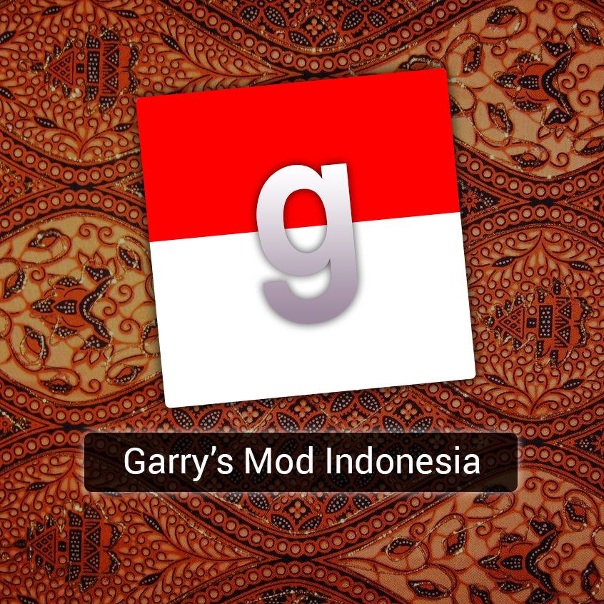

<a href="#">Link to GMOD Indonesia</a>

<h1 align="center">About Garry's Mod Indonesia Revived</h1>

This Website was dedicated from me to help with the developments of the Garry's Mod Indonesia Revived. Garry's Mod Indonesia Revived is a Indonesian server for Garry's Mod game.
This server has many gamemodes that can surely bring some joys from any stressfull days. Fun fact, this server was established since early 2015 by the owner named Wolvindra. It got some issues
back at late 2018 and the server got shut down. At the end of 2020, KamFretoZ, one of the Owner of this server and his friend Reynaldy, had an idea to bring this server back alive again.
So he and Reynaldy also Wolvindra worked together to bring this server up and they relaunched this server in the early 2021 precisely around June - July. At the end, Enjoy the server!!
And surely leave some comments or any suggestions to <a href="mailto:raenelvin29@gmail.com?subject=subject text">my email </a>

<h1 align="center">How to Install Laravel to Localhost (on Windows)</h1>

<ol>
    <li>Download and install <a href="https://www.apachefriends.org/download.html"> XAMPP</a></li>
    <li>Download and install <a href="https://getcomposer.org/download/">Composer</a></li>
    <li>Download and install <a href="https://git-scm.com/downloads">Git Bash</a></li>
    <li>Open <code>C:\xampp\htdocs</code></li>
    <li>Delete all contents in the htdocs</li>
    <li>Right click and click <code>Git Bash Here</code></li>
    <li>Type <code>composer create-project laravel/laravel GMIWebsite</code></li>
    <li>Clone this git into the GMIWebsite folder (Rewrite it all)</li>
    <li>Go Back to Git Bash and type <code>cp .env.example .env</code></li>
    <li>Open the XAMPP and start the Apache and MYSQL</li>
    <li>Click the Admin tab on MYSQL section</li>
    <li>Create a <a href="http://webvaultwiki.com.au/Default.aspx?Page=Create-Mysql-Database-User-Phpmyadmin&NS=&AspxAutoDetectCookieSupport=1#:~:text=Using%20phpMyAdmin%20Version%203.5.,-1%C2%B6&text=Browse%20to%20your%20phpMyAdmin%20URL,dba%20user%20login%20as%20shown.&text=In%20the%20create%20database%20field,Click%20Create.">database</a></li>
    <li>Open the env file in VSCode or any Text Editor</li>
    <li>Replace the <code>DB_DATABASE=laravel</code> with your database name</li>
    <li>Last but not least, type in git bash <code>php artisan migrate && php artisan serve</code></li>
    <li>Your Website is ready to open, just open <code>http://127.0.0.1:8000/</code>in your browser</li>
</ol>

